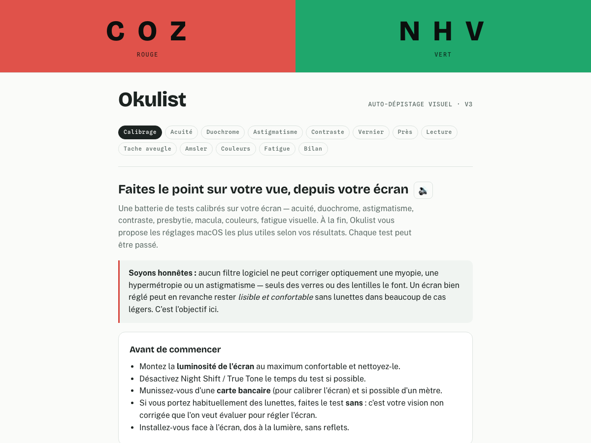

# Okulist 👁️

**Auto-dépistage visuel dans le navigateur, calibré sur votre écran.**

Okulist est une page web autonome (un fichier HTML, zéro dépendance à l'exécution)
qui enchaîne une batterie de tests de dépistage visuel, trace votre évolution de
bilan en bilan, puis propose les réglages macOS les plus utiles selon vos résultats.



> ⚠️ **Okulist est un outil indicatif, pas un dispositif médical.** Il ne mesure pas
> votre réfraction et ne remplace ni un examen ophtalmologique ni des lunettes.
> Aucun filtre logiciel ne peut corriger optiquement une myopie, une hypermétropie
> ou un astigmatisme. En cas de doute ou de résultat anormal, consultez un
> ophtalmologiste ou un orthoptiste.

## Les tests

| Test | Principe | Dépiste |
|---|---|---|
| Calibrage écran | Carte bancaire (85,6 mm) posée contre l'écran → px/mm réels | — |
| Calibrage gamma | Trame 1 px noir/blanc appariée à un gris ajustable | — |
| Suivi de distance *(bêta)* | Webcam + diamètre d'iris (11,7 mm), focale calibrée à distance mesurée — tout en local | — |
| Acuité de loin (par œil) | Anneaux de Landolt normalisés, **8 orientations**, escalier psychophysique, échelle en dixièmes | Baisse d'acuité |
| Duochrome rouge/vert (par œil) | Netteté comparée sur fonds rouge et vert | Tendance myopique / hypermétropique |
| Cadran d'astigmatisme (par œil) | Lignes rayonnantes d'épaisseur identique | Astigmatisme |
| Sensibilité au contraste | Anneau à contraste décroissant (jusqu'à 1,5 %), corrigé du gamma mesuré | Baisse de contraste |
| Acuité vernier | Alignement de deux traits, décalages sous-pixel (jusqu'à 12″ d'arc) | Hyperacuité réduite |
| Vision de près à 40 cm | Texte à hauteur de capitale millimétrée (mesurée au canvas) | Presbytie |
| Vitesse de lecture | Type MNREAD simplifié : vitesse par taille → taille critique → taille de texte macOS recommandée en mm | Besoin d'agrandissement |
| Tache aveugle (par œil) | Point animé en périphérie, position et largeur en degrés | Scotome atypique |
| Grille d'Amsler (par œil) | Grille 10 × 10 cm, fixation centrale | Anomalies maculaires |
| Vision des couleurs | Planches à points sur les **lignes de confusion CIE** (protan, deutan, tritan) + planche témoin | Déficiences colorées |
| Fatigue visuelle numérique | Questionnaire en 6 items | Fatigue / sécheresse oculaire |

Le bilan final classe chaque résultat (OK / à surveiller / consultez), archive la
séance, et à partir du deuxième bilan affiche l'**évolution** (courbe d'acuité par
œil + tableau des séances). Les réglages macOS marqués « Pour vous » découlent des
résultats : résolution « Texte plus grand », zoom ctrl + molette, contraste
renforcé, taille de texte cible en millimètres, filtres de couleur, Night Shift,
règle 20-20-20…

Chaque étape est passable, dispose d'une **lecture vocale des consignes** (🔊) et
répond au clavier (flèches, chiffres 1–9, espace).

## Utilisation

Ouvrez simplement `index.html` dans un navigateur :

```sh
open index.html          # ou npm run serve → http://localhost:8123
```

Aucun serveur ni réseau requis, hormis les polices Google Fonts (avec repli
système) et, si vous l'activez, le modèle FaceMesh du suivi de distance. Résultats,
calibrages et historique restent dans le `localStorage` du navigateur — rien n'est
envoyé nulle part. Servie en HTTPS, la page s'installe comme **PWA** et fonctionne
hors ligne.

### Conseils pour un test fiable

- Luminosité de l'écran au maximum confortable, écran propre, sans reflets.
- Night Shift / True Tone désactivés le temps du test.
- Une carte bancaire pour le calibrage, un mètre pour la distance.
- Testez **sans** vos lunettes : c'est la vision non corrigée qu'on évalue pour régler l'écran.

## Développement

```sh
npm test        # tests unitaires du cœur (node --test)
npm run build   # réinjecte src/core.js dans index.html
npm run e2e     # tests de bout en bout (Playwright, Chromium)
```

- `src/core.js` — la logique pure et testée (géométrie visuelle, escaliers
  psychophysiques, gamma, colorimétrie CIE, interprétations). C'est la **source de
  vérité** : `tools/build.mjs` l'injecte dans `index.html` entre les marqueurs
  `==CORE==`, et la CI vérifie que le fichier committé est à jour.
- `index.html` — l'interface complète, auto-suffisante (HTML + CSS + JS vanilla).
- `e2e/` — scénarios Playwright (chargement sans erreur, parcours complet,
  bilan, historique, clavier).
- CI GitHub Actions : tests unitaires, build reproductible, e2e.

### Notes techniques

- Optotypes : anneaux de Landolt SVG normalisés (ouverture = trait = ⅕ du
  diamètre), taille depuis l'angle visuel (1′ d'arc à 10/10) via px/mm et distance.
- Contraste de Weber corrigé par le gamma **mesuré** de l'écran, pas supposé.
- Planches couleur générées sur `<canvas>` avec des chromaticités xyY converties
  en sRGB le long des lignes de confusion des points copunctaux protan
  (0,747 ; 0,254), deutan (1,4 ; −0,4) et tritan (0,175 ; 0), luminance bruitée.
- Acuité vernier rendue en sous-pixel grâce à l'anticrénelage (~0,2 px utile).
- Suivi de distance : MediaPipe FaceMesh (`refineLandmarks`), diamètre d'iris
  moyen 11,7 mm, focale calibrée une fois à distance connue au mètre.
- Thèmes clair et sombre ; les surfaces de test restent volontairement blanches
  (condition photopique). Couleurs du graphique d'évolution validées daltonisme
  et contraste sur les deux thèmes.

## Licence

[MIT](LICENSE)
